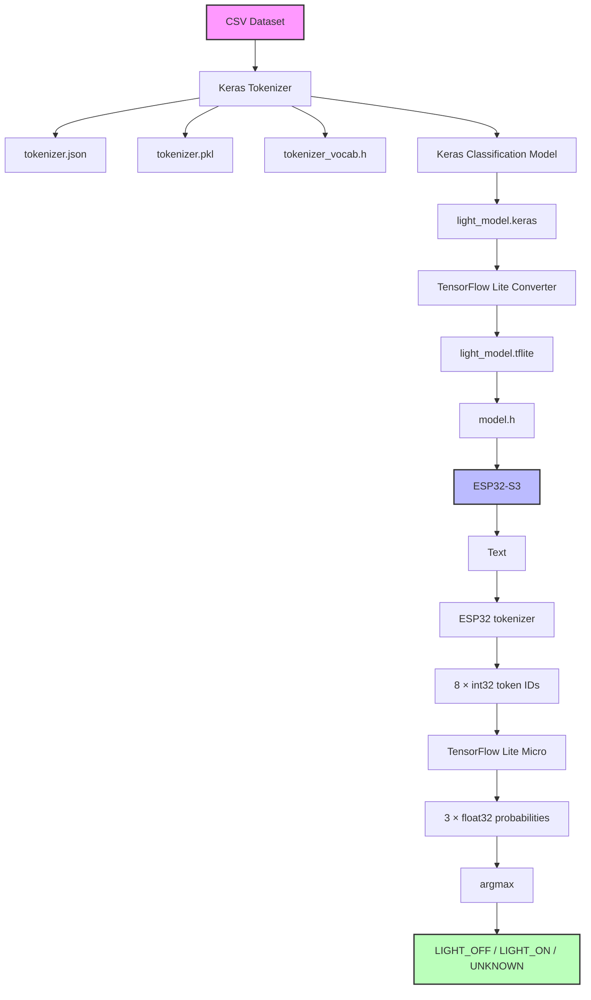
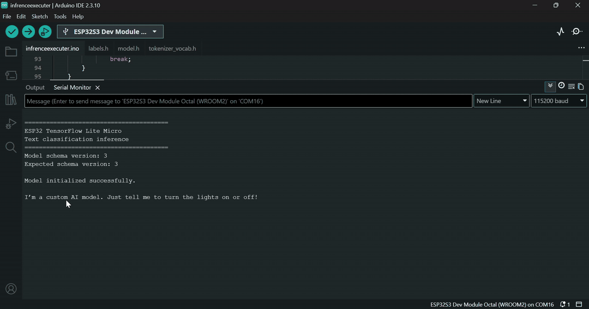

# TensorFlow Lite Text Classification on ESP32-S3
The goal of the project is to prove that a custom trained model can be deployed on to a small edge device.
The sequancial  model was trained on simple CPU 

# User Case
Wanted the ESP32-S3 micro controller to understand simple English commands like:
    - Switch off the light
    - Switch off the light
It is a simple classification task model, LIGHT_OFF, LIGHT_ON and UNKNOWN

# Hardware
 It is ESP32-S3 Dev Kit Micro controller. 
 Avoid buying cloned. 

```text
ESP32-S3
Revision: v0.2
CPU: 240 MHz
PSRAM: 16 MB
```

# IDE 
VS Code for python and Arduino for uploading code onto ESP32-S3

# Software Libs 
 
 TensorFlowLite_ESP32
 - Tensorflow Lite, I have ended up modifying some file from the lib


## Lib modification details

This project runs a custom TensorFlow/Keras text-classification model on an **ESP32-S3** using the Arduino `TensorFlowLite_ESP32` library.

The model accepts a sequence of **8 integer token IDs** and produces **3 floating-point class probabilities**:

```text
Input:
[1, 8] int32

Output:
[1, 3] float32
```

Current classes:

```text
0 = LIGHT_OFF
1 = LIGHT_ON
2 = UNKNOWN
```

The ESP32 inference output has been verified against the Python TensorFlow Lite interpreter and produces matching results.

---

## 1. Project Architecture
The model was trained on an simple english sentences generated using gpt.

The complete pipeline is:


---
### `TensorFlowLite_ESP32` Lib code changes
The library required a few source modifications to compile/work correctly with this ESP32-S3 setup.

The Arduino library is located under:

```text
../Arduino/libraries/TensorFlowLite_ESP32
```


#### Modified TensorFlowLite_ESP32 Library

These modifications are required for the current environment.

#### Remove `screen` folder

The `screen` folder was removed from the TensorFlow Lite library.

Remove:

```text
TensorFlowLite_ESP32/
└── screen/
```


---

#### `compatibility.h`

The `TF_LITE_REMOVE_VIRTUAL_DELETE` definition was modified.

The relevant section is:

```cpp
#define TF_LITE_REMOVE_VIRTUAL_DELETE \
public: \
  inline void operator delete(void* p) noexcept {}
#else
```

Changes are:

```text
change method scope from private to public
make it as an inline
and noexcept
```

The purpose is to provide the required `operator delete` implementation while avoiding the compilation issues encountered with the ESP32 build.

---

#### `stl_emulation.h`

In `stl_emulation.h`, the `span` assignment operator was modified.

Original code included:

```cpp
FLATBUFFERS_CONSTEXPR_CPP14 span &operator=(const span &other)
    FLATBUFFERS_NOEXCEPT {
  data_ = other.data_;
  count_ = other.count_;
}
```

The working modification was:

```cpp
FLATBUFFERS_CONSTEXPR_CPP14 span &operator=(const span &other)
    FLATBUFFERS_NOEXCEPT {
  data_ = other.data_;
  // count_ = other.count_;
  size_type count_;
}
```

Keep this modification documented because it is a local modification to the TensorFlow Lite library and may need to be reapplied if the library is reinstalled or updated.

---

### Training Dataset

The model is trained from:

```text
dataset/generated_dataset.csv
```

The CSV contains at least:

```text
text
label
```

Example structure:

```text
text,label
turn the light on,LIGHT_ON
turn the light off,LIGHT_OFF
hello,UNKNOWN
```

Training loads the dataset using:

```python
df = pd.read_csv("dataset/generated_dataset.csv")

texts = df["text"].values
labels = df["label"].values
```

---

## Label Encoding

Labels are converted to integer class IDs using `LabelEncoder`.

```python
encoder = LabelEncoder()

y = encoder.fit_transform(labels)
```

The current labels are:

```text
0 = LIGHT_OFF
1 = LIGHT_ON
2 = UNKNOWN
```

The labels are saved to:

```text
model/labels.json
model/label_encoder.pkl
```

A C++ header is also generated for ESP32:

```text
labels.h
```

Example:

```cpp
#pragma once

static const char* kLabels[] = {
    "LIGHT_OFF",
    "LIGHT_ON",
    "UNKNOWN"
};

static const int kNumLabels = 3;
```

---

##  Tokenizer

The model uses a Keras `Tokenizer`.

The tokenizer configuration is:

```python
tokenizer = Tokenizer(
    num_words=1000,
    oov_token=""
)
```

The tokenizer is fitted on the training text:

```python
tokenizer.fit_on_texts(texts)
```

Sequences are generated with:

```python
X = tokenizer.texts_to_sequences(texts)
```

The maximum sequence length is:

```python
MAX_LEN = 8
```

Padding is:

```python
X = pad_sequences(
    X,
    maxlen=MAX_LEN,
    padding="post",
    truncating="post"
)
```

Therefore every model input is exactly:

```text
8 integer token IDs
```

Padding uses:

```text
0
```

---

## Important Tokenizer Warning

Multiple tokenizer versions existed during development.

This is extremely important:

> The tokenizer vocabulary must match the model that was trained with it.

For example, the currently deployed model uses IDs such as:

```text
turn      = 28
the       = 2
light     = 5
on        = 15
off       = 13
please    = 6
bedroom   = 22
hello     = 45
make      = 20
room      = 17
brighter  = 1
```

A different tokenizer generated different IDs.

For example, another tokenizer version produced:

```text
turn      = 3
light     = 4
on        = 5
off       = 6
```

Those tokenizers are **not interchangeable**.

Using the wrong tokenizer with a model produces incorrect predictions even though the TensorFlow Lite model itself is functioning correctly.

Always generate `tokenizer_vocab.h` from the tokenizer associated with the model being deployed.

---

## Generate `tokenizer_vocab.h`

The Python tokenizer vocabulary is exported into a C++ header so the ESP32 can perform token lookup without Python.

The generated header contains entries similar to:

```cpp
struct VocabEntry {
    const char* word;
    int32_t id;
};

static const VocabEntry kVocabulary[] = {
    {"<UNK>", 1},
    {"the", 2},
    {"turn", 28},
    ...
};
```

The ESP32 performs a lookup:

```text
word  -> vocabulary lookup -> integer token ID
```

Unknown words use the OOV token ID.

---

### Model Architecture
### Model Summary: "sequential"

| Layer (type) | Output Shape | Param # |
| :--- | :--- | :--- |
| **embedding** (Embedding) | (None, 8, 16) | 16,000 |
| **average_embedding** (GlobalAveragePooling1D) | (None, 16) | 0 |
| **dense** (Dense) | (None, 16) | 272 |
| **classification** (Dense) | (None, 3) | 51 |

### Parameter Metrics
* **Total params**: 16,323 (63.76 KB)
* **Trainable params**: 16,323 (63.76 KB)
* **Non-trainable params**: 0 (0.00 B)

---

## TensorFlow Lite Conversion

After training the model is a **float32 model**.

No integer quantization is used.

ESP32 input/output types are:

```text
Input  = int32
Output = float32
```

---

## TFLite Model Operators

The final deployed model was simplified so that it uses only operators supported by the TensorFlow Lite Micro library:

```text
GATHER <- EmbeddingLookup class
MEAN
FULLY_CONNECTED
FULLY_CONNECTED
SOFTMAX
```

## Verify TFLite Model
Full code implementation - ./inspect\inspect_model.py

Inspect the model:

```python
interpreter = tf.lite.Interpreter(
    model_path="model/light_model.tflite"
)
interpreter.allocate_tensors()

input_details = interpreter.get_input_details()
output_details = interpreter.get_output_details()
```

Expected input:

```text
shape: [1 8]
dtype: int32
```

Expected output:

```text
shape: [1 3]
dtype: float32
```

---


## Generate `model.h`

The `.tflite` file is converted into a C++ header for inclusion in the Arduino project.

The model must be stored as a 4-byte-aligned array.

---

# ESP32 Model Initialization

Over view of the model inference code. 

```cpp
// Load model
model = tflite::GetModel(light_model_tflite);
```

```cpp
// allocate memory
interpreter->AllocateTensors();
```
---

## ESP32 Input
Use Arduino IDE Serial monitor for testing.




The model expects:

```text
[1, 8] int32
```

Therefore the ESP32 writes token IDs using:

```cpp
input->data.i32[i] = tokens[i];
```

For example:

```text
"turn the light on"
```

becomes:

```text
[28, 2, 5, 15, 0, 0, 0, 0]
```

---

## ESP32 Output

The model outputs:

```text
[1, 3] float32
```

Therefore the ESP32 reads:

```cpp
float probability = output->data.f[i];
```

The three values correspond to:

```text
0 = LIGHT_OFF
1 = LIGHT_ON
2 = UNKNOWN
```

The predicted class is the index with the highest probability.

---

# End-to-End Verification

The most important validation performed was to run the exact same token IDs through:

1. Python TensorFlow Lite
2. ESP32 TensorFlow Lite Micro

For:

```text
turn the light on
```

input:

```text
[28, 2, 5, 15, 0, 0, 0, 0]
```

Python:

```text
[0.0003218588,
 0.9995523095,
 0.0001258605]
```

ESP32:

```text
[0.000322,
 0.999552,
 0.000126]
```

Result:

```text
LIGHT_ON
```

---

## Verification Results

### Turn light on

```text
Input:
[28, 2, 5, 15, 0, 0, 0, 0]

Output:
LIGHT_OFF: 0.000322
LIGHT_ON:  0.999552
UNKNOWN:   0.000126

Prediction:
LIGHT_ON
```

### Turn light off

```text
Input:
[28, 2, 5, 13, 0, 0, 0, 0]

Output:
LIGHT_OFF: 0.999273
LIGHT_ON:  0.000640
UNKNOWN:   0.000088

Prediction:
LIGHT_OFF
```

### Bedroom light on

```text
Input:
[6, 28, 2, 22, 5, 15, 0, 0]

Output:
LIGHT_OFF: 0.000505
LIGHT_ON:  0.999440
UNKNOWN:   0.000055

Prediction:
LIGHT_ON
```

### Hello

```text
Input:
[45, 0, 0, 0, 0, 0, 0, 0]

Output:
LIGHT_OFF: 0.000263
LIGHT_ON:  0.001884
UNKNOWN:   0.997853

Prediction:
UNKNOWN
```

### Make room brighter

```text
Input:
[20, 2, 17, 1, 0, 0, 0, 0]

Output:
LIGHT_OFF: 0.580315
LIGHT_ON:  0.416532
UNKNOWN:   0.003153

Prediction:
LIGHT_OFF
```

The last example demonstrates that the ESP32 is reproducing the model exactly, even when the model makes a questionable classification.

---


## Known Limitations

## Tokenizer compatibility

The ESP32 tokenizer is a lightweight C++ implementation.

It currently reproduces the behavior required by the project's simple command vocabulary, but it is not a complete implementation of every possible Keras `Tokenizer` feature.

Any change to tokenizer configuration should be reflected in the ESP32 tokenizer.

---

## Vocabulary/model coupling

Never replace `tokenizer_vocab.h` independently of the model.

The vocabulary IDs are part of the model's input representation.

These must remain synchronized:

```text
training tokenizer
       +
TFLite model
       +
tokenizer_vocab.h
```

---

## Model confidence

The model currently uses simple `argmax()` classification.

For production use, consider a confidence threshold:

```text
if max_probability < threshold:
    UNKNOWN
else:
    predicted class
```

This can prevent uncertain predictions from triggering physical actions.

---

The next development phase is to connect the classification results to actual ESP32 actions, such as:

```text
LIGHT_ON  → GPIO HIGH
LIGHT_OFF → GPIO LOW
UNKNOWN   → no action
```
# TBD 
Improve the training dataset/model for ambiguous commands before allowing predictions to control hardware.
