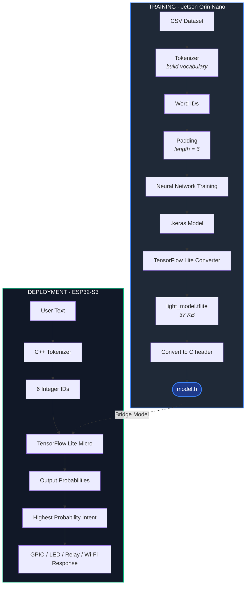

# User Case
Wanted the ESP32-S3 micro controler to understand simple English commands like:
    - Switch off the light
    - Switch off the light

## Train Model
### Dataset
|text | label |
|---|---|
|turn on the light|LIGHT_ON|
|switch off the light | LIGHT_OFF|
|hello |UNKNOWN|

### Text → Numbers
Neural networks can only understand numbers, lets use Keras tokenizer to convert the text into unmbers.
Suppose our vocabulary like "turn on light" becomes
 - turn      -> 28
 - on        -> 15
 - light     -> 5
 - switch    -> 21
 - off       -> 13

Another example : 
    *switch on light* -> [21, 15, 5, 0, 0, 0]

 - switch = 21
 - on     = 15
 - light  = 5

On ESP32 micro controller it is : {21,15,5,0,0,0}
0's are padding

### Vocabulary
The tokenizer built a dictionary.
{
 "light":5,
 "switch":21,
 "off":13,
 ...
}

### Sequence Padding
max_len = 6

### Label Encoding
LIGHT_OFF -> 0
LIGHT_ON -> 1
UNKNOWN -> 2

### TensorFlow Lite Conversion
Microcontrollers cannot load Keras models, so convert it to .tflite which is 37 KB

### Convert Model to C Header 
This the model stored on micro controller - This is literally the TensorFlow Lite model stored as a byte array in flash memory

The ESP32 has no filesystem by default. light_model.tflite
convert light weight to tflite which is model.h file in this project

### Tokenizer on MC
ESP32-S3 cannot execute Python. So must manually recreated. This "switch on lights" converts to "[21,15,44]" on MC

### TensorFlow Lite Micro
The ESP32-S3 runs TensorFlow Lite Micro and it includes
 - interpreter
 - memory allocator
 - operators

Everything is optimized for embedded devices.

### Tensor Arena
The ESP32-S3 doesn't allocate memory dynamically for every operation.
We create one block of RAM:

```
uint8_t tensor_arena[20 * 1024];
```

## Run infrence
```
Sentence -> Tokenizer -> Word IDs -> Padding ->  Input Tensor -> Interpreter -> Output Tensor
```

### Final 
LIGHT_ON ->  digitalWrite(GPIO,HIGH)

### Complete flow
